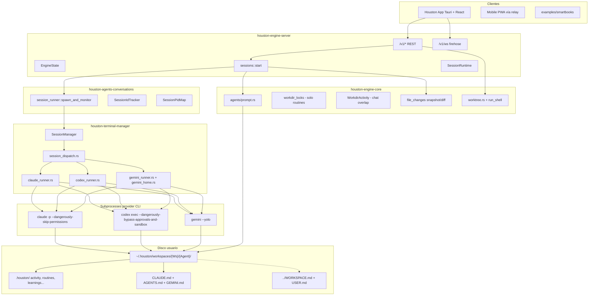
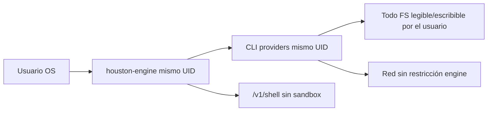
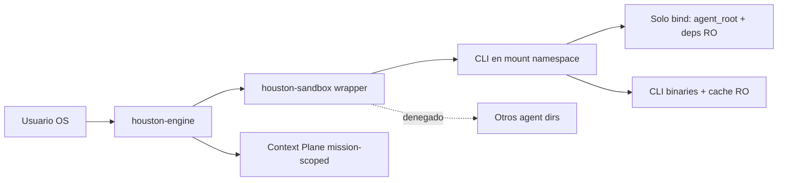
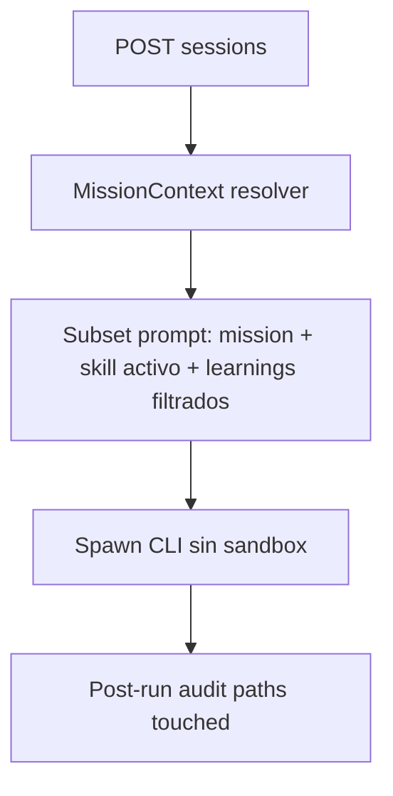
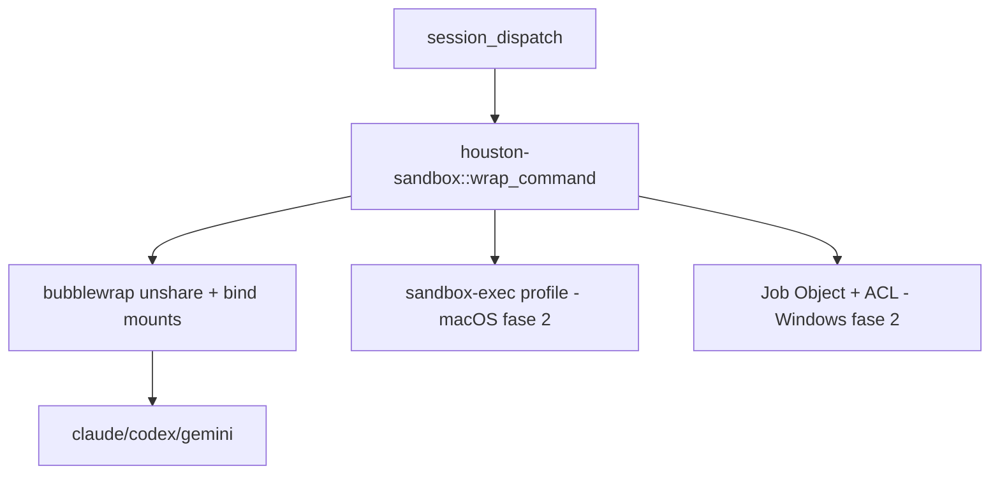
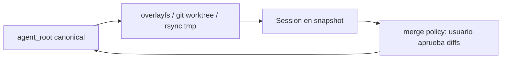
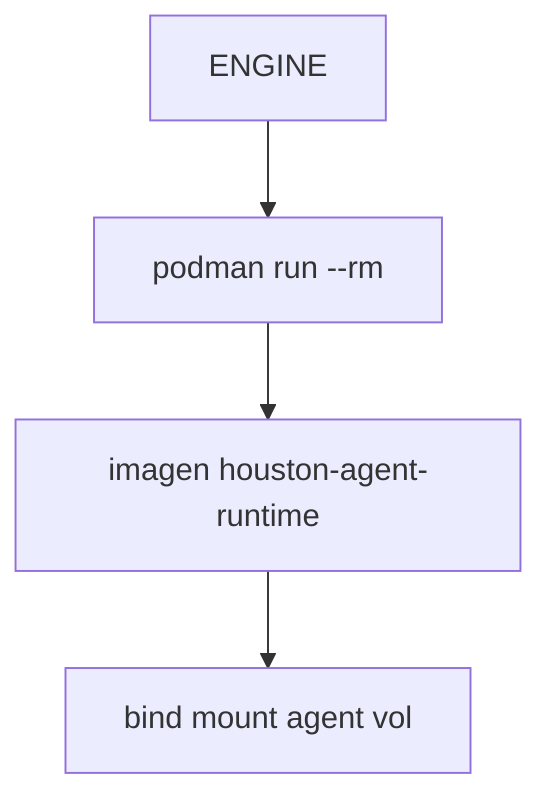
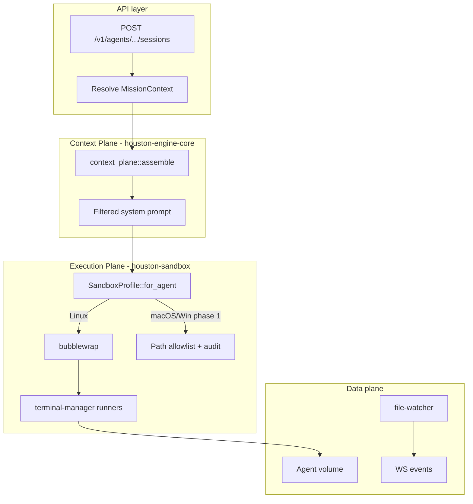

# Houston Hackathon: Agent Orchestration & Isolation

Documento de diseño para el hackathon de orquestación multi-agente en Houston. Objetivo: que otro LLM pueda implementar cambios sin explorar todo el repo desde cero.

**Alcance:** un solo `houston-engine` por máquina (sin multi-servidor), aislamiento fuerte entre agentes, los tres providers (Claude, Codex, Gemini), eficiencia de tokens.

**Estado del código referenciado:** commit base del worktree actual (junio 2026). Rutas absolutas del monorepo: `/home/sebasvelace/houston/`.

---

## Executive summary

Houston hoy orquesta agentes como **subprocesses de CLI con privilegios del usuario**, no como sandboxes. El engine (`houston-engine-server`) es un proceso Axum único que:

1. Ensambla un system prompt grande (`product_prompt` + `agent_context`).
2. Spawnea `claude` / `codex` / `gemini` con `current_dir = working_dir`.
3. Streamea NDJSON/JSON por WS.
4. Persiste chat en SQLite y datos de agente en `.houston/` en disco compartido.

**Fortalezas:** arquitectura de crates limpia, cola por `session_key`, resume por provider, atribución de cambios de archivos, aislamiento parcial de memoria Gemini (`gemini_home.rs`), límites de learnings, índice compacto de skills.

**Debilidades críticas:** los tres CLIs corren con permisos totales del usuario (`--dangerously-skip-permissions`, `--dangerously-bypass-approvals-and-sandbox`, `--yolo`); no hay jail de filesystem entre Agent A y Agent B; `/v1/shell` ejecuta comandos arbitrarios; el bloqueo por `working_dir` solo aplica a **routines**, no a sesiones de chat paralelas.

**Recomendación para el hackathon:** **Ruta 2 (Sandbox OS por subprocess) + Ruta 1 (Context Plane mission-scoped)**. Semana 1: nuevo crate `houston-sandbox` con bubblewrap en Linux + ensamblador de contexto por misión + worktree opcional por misión. macOS/Windows: degradación honesta (policy + paths) hasta sandbox nativo en fase 2. No intentar Podman/Firecracker en el desktop app en una semana.

---

## Problem statement

El usuario del hackathon pide:

| Requisito | Gap actual |
|-----------|------------|
| Ciclo completo aislado: cada agente solo ve lo que necesita | System prompt inyecta workspace completo, skills index, learnings, integraciones; CLI lee todo el FS accesible al usuario |
| Orquestación escalable sin múltiples servidores | ✅ Un solo `houston-engine`; falta aislamiento real y scheduling consciente de recursos |
| Agent A no puede leer archivos de Agent B | ❌ Solo convención en prompt; CLIs pueden `Read` paths absolutos fuera del agent dir |
| Working directory aislado | Parcial: `current_dir` en spawn, pero sin mount namespace |
| Eficiencia de tokens | Contexto monolítico por sesión; resume ayuda pero el system prompt se repite |
| Claude + Codex + Gemini | ✅ Tres runners en `session_dispatch.rs` |
| Rediseño mayor OK si documentado | Este documento |

---

## Current architecture (as-is)

### Diagrama de flujo



### Capas y responsabilidades

| Capa | Crate / módulo | Rol |
|------|----------------|-----|
| Wire | `houston-engine-protocol`, `ui/engine-client` | DTOs REST + WS |
| Server | `houston-engine-server/src/routes/*` | 17 módulos de rutas |
| Orquestación | `houston-engine-core/src/sessions/mod.rs` | Cola, prompt, activity flip, file_changes |
| Conversación | `houston-agents-conversations/src/session_runner.rs` | Eventos, persistencia, auth |
| Terminal | `houston-terminal-manager` | Spawn CLI, parse streams |
| Datos agente | `houston-agent-files` | I/O `.houston/` con `safe_relative` |
| Reactividad | `houston-file-watcher` | `notify` → `HoustonEvent` |

### Flujo de una sesión de chat (detalle)

1. **Cliente** `POST /v1/agents/:agent_path/sessions` con `{ sessionKey, prompt, workingDir?, provider?, model? }` (`routes/sessions.rs`).
2. **`sessions::start`** encola por `(agent_path, session_key)` vía `SessionTurnLocks` + `SessionControl` (`control.rs`).
3. **`run_start`** (`sessions/mod.rs:179+`):
   - `seed_agent()` → `CLAUDE.md`, symlinks `AGENTS.md` / `GEMINI.md`.
   - `build_agent_context()` → working dir rules, mode, learnings, skills index, WORKSPACE.md/USER.md, integrations.
   - Concatena `HOUSTON_APP_SYSTEM_PROMPT` + `agent_context`.
   - Registra overlap en `WorkdirActivity` (no bloquea segundo chat en la misma carpeta).
   - Snapshot pre-run para `file_changes`.
4. **`session_runner::spawn_and_monitor`** → `SessionManager::spawn_session` → `session_dispatch::dispatch`.
5. **Runner** setea `current_dir(working_dir)` y flags de auto-approve (ver sección seguridad).
6. Al terminar: flip activity `needs_you`/`error`, diff de archivos si no hubo overlap.

### Providers (matriz actual)

| Provider | Runner | Binary resolve | Auto-approve | Aislamiento extra |
|----------|--------|----------------|--------------|-------------------|
| `anthropic` | `claude_runner.rs` | `claude_install_path` | `--dangerously-skip-permissions` | Ninguno |
| `openai` | `codex_runner.rs` | `houston-cli-bundle::bundled_codex_path` | `--dangerously-bypass-approvals-and-sandbox` | Ninguno |
| `gemini` | `gemini_runner.rs` | `provider.resolve()` bundled/PATH | `--yolo` | `HOME` → `~/.houston/runtime/gemini-home/` |

Referencias de flags:

```148:151:engine/houston-terminal-manager/src/claude_runner.rs
    if disable_all_tools {
        cmd.arg("--allowedTools").arg("");
    } else {
        cmd.arg("--dangerously-skip-permissions");
```

```14:18:engine/houston-terminal-manager/src/codex_command.rs
    let mut args = vec![
        OsString::from("exec"),
        OsString::from("--json"),
        OsString::from("--dangerously-bypass-approvals-and-sandbox"),
        OsString::from("--skip-git-repo-check"),
```

Gemini: `--yolo` documentado en `gemini_runner.rs` como equivalente Houston de skip-permissions.

### Concurrencia

- **Por session_key:** turns serializados (`SessionTurnLocks`).
- **Por working_dir (chat):** paralelo permitido; `WorkdirActivity` solo desactiva atribución de `file_changes`.
- **Por working_dir (routines):** `try_acquire_workdir` → 409 Conflict (`engine_dispatcher.rs:41`).
- **Global CLI cap:** `concurrency.rs` semáforo default 15 (no wired en todos los paths; verificar uso en spawn).

### Worktrees

`worktree.rs`: `git worktree add` en `{repo}-worktrees/{name}`. Usado para paralelismo git, **no** integrado automáticamente en cada misión. El agente/working_dir puede ser un worktree si el frontend lo pasa.

### Punto de acoplamiento: `/v1/shell`

```191:218:engine/houston-engine-core/src/worktree.rs
pub async fn run_shell(req: RunShellRequest) -> CoreResult<String> {
    let dir = expand_tilde(&PathBuf::from(&req.path));
    // ...
    let output = Command::new("sh")
        .args(["-c", &req.command])
        .current_dir(&dir)
        // ...
```

Sin authz por agente. Cualquier cliente con bearer token puede ejecutar shell en cualquier `path` existente. **Agujero de seguridad** para multi-agente.

---

## First principles glossary

| Término | Definición en Houston |
|---------|----------------------|
| **Engine** | Binario `houston-engine` (Axum). Un proceso por desktop/VPS. |
| **Agent** | Directorio `~/.houston/workspaces/{Workspace}/{Agent}/` con `CLAUDE.md` + `.houston/`. |
| **Workspace** | Carpeta padre con `.houston/` a nivel workspace + `WORKSPACE.md` / `USER.md`. |
| **Session / Mission** | Conversación identificada por `session_key`; fila en `activity.json` en el board. |
| **Turn** | Un spawn de CLI por mensaje de usuario (cola si mismo `session_key`). |
| **Working directory** | `cwd` del CLI; default = `agent_dir`, override vía API. |
| **Agent context** | Bloque engine-owned en system prompt (`build_agent_context`). |
| **Product prompt** | Voz Houston; env `HOUSTON_APP_SYSTEM_PROMPT` desde Tauri. |
| **Provider resume ID** | `.houston/sessions/{provider}/{session_key}.sid` |
| **Isolation** | Separación FS + credenciales + contexto LLM entre agentes. |
| **Context Plane** | Capa que decide qué texto entra al prompt (propuesto). |
| **Execution Plane** | Subprocess CLI + sandbox OS (propuesto). |

---

## Security model today vs target

### Hoy (trust-boundary = usuario Unix/Windows)



| Control | Estado | Notas |
|---------|--------|-------|
| Path traversal en REST `.houston/` | ✅ | `houston-agent-files::safe_relative` |
| Aislamiento FS entre agentes | ❌ | Prompt dice "no salgas del dir"; CLI ignora |
| Auto-approve tools | ⚠️ | Requerido para UX non-technical |
| Gemini global memory | 🟡 | Mitigado con `gemini_home.rs` |
| Claude/Codex global config | ❌ | Leen `~/.claude`, `~/.codex` del usuario real |
| Shell escape hatch | ❌ | `/v1/shell` |
| Token bearer | 🟡 | Loopback + archivo mode 0600; no aislamiento entre agentes |
| Composio MCP | ❌ | Tools pueden operar fuera del agent dir |

### Target (post-hackathon)



**Principio:** Houston asume que **el modelo + CLI es hostil**. La política de prompt no es seguridad. El sandbox OS es la frontera real.

**Claude `--dangerously-skip-permissions`:** flag explícito de Anthropic que desactiva prompts de aprobación. En Houston es **intencional** (`manager.rs:19`) para automatización, pero implica:

- Cualquier tool invocation aprobada sin humano.
- Si el sandbox FS falla, el daño es equivalente a `rm -rf` con credenciales del usuario.
- **Acción hackathon:** mantener el flag (providers lo requieren para headless) pero **nunca** depender de él como control de seguridad; documentar en KB y restringir network/fs vía sandbox.

---

## Architectural routes

### Ruta 1: Aislamiento lógico (Context Plane + policy)

**Pitch:** Mejorar orquestación sin sandbox OS; máximo ROI en tokens y mínimo riesgo de integración CLI.



| Aspecto | Detalle |
|---------|---------|
| **Aislamiento** | Solo prompt + convenciones; **Agent A puede leer Agent B** |
| **Componentes** | `agents/prompt.rs`, nuevo `agents/context_plane.rs`, `activity.json` schema extendido |
| **Providers** | ✅ Sin cambios en runners |
| **Tokens** | Alto impacto: inyectar solo misión/skill activo |
| **N concurrent agents** | Limitado por semáforo 15 + RAM; sin overhead de sandbox |
| **Linux/macOS/Windows** | ✅ Paridad completa |
| **Complejidad** | **S** |
| **Semana 1** | Mission-scoped context, dedup workspace, skill-on-demand |
| **Follow-up** | RAG local sobre `.houston/`, post-run path audit |

**Pros:** Rápido, cross-platform, no rompe CLIs.  
**Cons:** No cumple requisito "Agent A no lee Agent B" de forma fuerte.  
**Riesgos:** Falsa sensación de seguridad.

---

### Ruta 2: Sandbox OS por subprocess (recomendada base)

**Pitch:** Wrapper único alrededor de cada spawn; bubblewrap en Linux, degradación documentada en macOS/Windows.



| Aspecto | Detalle |
|---------|---------|
| **Aislamiento** | Fuerte FS en Linux; network opcional `--unshare-net` |
| **Componentes nuevos** | Crate `houston-sandbox`, cambios en `claude_runner.rs`, `codex_runner.rs`, `gemini_runner.rs`, `cli_process.rs` |
| **Providers** | ✅ Si el CLI corre dentro del namespace; verificar paths a bundled binaries |
| **Tokens** | Neutral (mismo prompt) |
| **Startup latency** | Linux +50-200ms por bwrap |
| **N agents** | ~10-15 en desktop típico (semáforo existente) |
| **Complejidad** | **L** (XL si paridad estricta 3 OS) |

**Layout bind mount propuesto (Linux):**

```
--ro-bind /usr /usr                    # deps dinámicas (debate: usar --ro-bind /)
--ro-bind {bundled_bin} {bundled_bin}
--bind {agent_root} {agent_root}       # rw solo agente
--bind {workspace_md} {workspace_md}   # rw si policy lo permite
--ro-bind {git_common_dir} ...         # si worktree
--tmpfs /tmp
--dev /dev
--proc /proc
```

**Pros:** Aislamiento real sin segundo servidor; patrón usado por Flatpak/Toolbox.  
**Cons:** Cross-platform es **doloroso**; Codex/Claude pueden necesitar paths extra (`git`, `bash`, `node`).  
**Riesgos:** CLIs rotos si falta un bind; Windows sin bwrap.

**Semana 1 hackathon:** Linux-only PoC + feature flag `HOUSTON_SANDBOX=1`.  
**Follow-up:** perfiles macOS `sandbox-exec`, Windows restricted token.

---

### Ruta 3: Workspace efímero copy-on-write

**Pitch:** Cada misión corre en snapshot aislado; sync selectivo al terminar.



| Variante | Linux | macOS | Windows | Latencia | Tokens |
|----------|-------|-------|---------|----------|--------|
| **git worktree** (ya existe) | ✅ | ✅ | ✅ | Baja | Neutral |
| **overlayfs + upper tmpfs** | ✅ | ❌ nativo | ❌ | Media | Neutral |
| **rsync copy full agent dir** | ✅ | ✅ | ✅ | Alta (100ms-5s) | Neutral |
| **FUSE overlay (unionfs-fuse)** | ✅ | 🟡 | ❌ | Media | Neutral |

| Aspecto | Detalle |
|---------|---------|
| **Aislamiento** | Fuerte durante misión; canonical intacto hasta merge |
| **Integración CLI** | ✅ cwd en snapshot |
| **Providers** | ✅ |
| **Complejidad** | **L** |
| **Semana 1** | Auto-worktree por misión + merge UI mínimo |
| **Follow-up** | overlayfs donde disponible |

**Pros:** Auditoría clara (diff al merge); combinable con Ruta 2.  
**Cons:** Copias duplican disco; merge conflictivo con sesiones paralelas.  
**Riesgos:** Usuario pierde cambios si merge falla silenciosamente (prohibido por policy Houston: surface errors).

---

### Ruta 4: Contenedores rootless (Podman/Docker)

**Pitch:** Un contenedor por sesión/agente; imagen mínima con CLIs montados.



| Aspecto | Linux | macOS | Windows |
|---------|-------|-------|---------|
| Podman rootless | ✅ | 🟡 Lima VM | 🟡 WSL2 |
| Docker Desktop | ✅ | ✅ VM | ✅ |
| Aislamiento | Fuerte | Fuerte (dentro VM) | Fuerte (WSL) |
| Latencia arranque | 1-5s | 2-10s | 2-10s |
| Mantenimiento | Media | Alta (doble VM) | Alta |

**Pros:** Modelo OCI estándar; útil para **Always On** (`always-on/`).  
**Cons:** **Inaceptable** como default desktop non-technical (Podman install, VM en Mac/Win).  
**Complejidad:** **XL** para app Tauri.  
**Veredicto hackathon:** documentar para VPS; **no** recomendar para semana 1 desktop.

---

### Ruta 5: MicroVMs (Firecracker / Cloud Hypervisor)

**Pitch:** Aislamiento casi-VM por agente; viable en servidor, no en laptop.

| Aspecto | Desktop Tauri | Always On VPS |
|---------|-------------|-----------------|
| Linux | 🟡 posible pero pesado | ✅ ideal |
| macOS | ❌ | N/A |
| Windows | ❌ | N/A |
| Latencia | 100ms-1s+ | Aceptable |
| Tokens | Neutral | Neutral |

**Pros:** Máximo aislamiento; multi-tenant futuro (`teams/`).  
**Cons:** Requiere KVM; antítesis de "sin múltiples servidores" si cada VM es mini-servidor.  
**Veredicto:** roadmap Teams/Cloud, **fuera** del hackathon desktop.

---

## Comparativa de mecanismos de aislamiento (referencia)

Tabla honesta cross-platform. "Escape CLI" = modelo convence al CLI a leer `/etc/passwd` o `~/.ssh`.

| Mecanismo | Linux | macOS | Windows | Fuerza | Escape CLI | Latencia | Integración CLIs | Madurez |
|-----------|-------|-------|---------|--------|------------|----------|------------------|---------|
| **Prompt-only** | ✅ | ✅ | ✅ | Muy baja | Trivial | 0 | Trivial | N/A |
| **Landlock (Rust `landlock` crate)** | ✅ kernel 5.13+ | ❌ | ❌ | Media-alta FS | Posible vía FD leak | Baja | Media (wrap pre-exec) | Activo |
| **bubblewrap (`bwrap`)** | ✅ | 🟡 build from source | ❌ | Alta FS | Difícil si binds correctos | 50-200ms | Media-alta | Maduro (Flatpak) |
| **firejail** | ✅ | ❌ | ❌ | Alta | Debate | 50-200ms | Media | Estable pero menos control |
| **chroot** | ✅ root | ✅ root | 🟡 | Media | Posible | Baja | Media | Legacy |
| **Linux namespaces (`nix` crate)** | ✅ | ❌ | ❌ | Alta | Difícil | Media | Alta (custom) | Maduro |
| **seccomp-bpf** | ✅ | ❌ | ❌ | Baja (syscalls) | No FS alone | Baja | Alta | Maduro |
| **sandbox-exec (Seatbelt)** | ❌ | ✅ | ❌ | Media-alta | Posible profile gaps | 50-300ms | Media | Apple legacy API |
| **Windows Job Objects + Low IL** | ❌ | ❌ | ✅ | Media | Posible | Media | Alta | Microsoft doc |
| **Rootless Podman** | ✅ | 🟡 VM | 🟡 WSL | Alta | Difícil | 1-5s | Media | Maduro |
| **Docker** | ✅ | ✅ VM | ✅ | Alta | Difícil | 1-5s | Media | Maduro |
| **Lima (Mac containers)** | ❌ | ✅ | ❌ | Alta | VM boundary | 5-15s | Baja desktop | Activo |
| **Firecracker microVM** | ✅ KVM | ❌ | ❌ | Muy alta | Muy difícil | 100ms+ | Baja | Maduro cloud |
| **FUSE overlay read-only view** | ✅ | 🟡 | ❌ | Media | Posible | Media | Media | Variable |
| **git worktree** | ✅ | ✅ | ✅ | Baja (mismo UID) | Trivial | 100ms-2s | ✅ ya en repo | Maduro |
| **Symlink jail** | ✅ | ✅ | ✅ | Muy baja | Trivial | 0 | Fácil | Frágil |
| **youki / libcontainer (OCI)** | ✅ | 🟡 | 🟡 | Alta | Difícil | 1-3s | Media | Activo |
| **tmpfs copy agent** | ✅ | ✅ | ✅ | Media (copia) | Trivial post-merge | 100ms-10s | ✅ | N/A |

**Crates Rust relevantes:**

| Crate | Uso |
|-------|-----|
| `nix` | unshare, mount namespaces, user namespaces |
| `landlock` / `landlock-safe` | políticas FS kernel-enforced pre-spawn |
| `libseccomp` | filtrar syscalls |
| `youki` | runtime OCI en Rust (pesado para hackathon) |

---

## Token efficiency strategies

### Estado actual (consumo)

| Bloque | Fuente | Cuándo | Tamaño típico |
|--------|--------|--------|---------------|
| Product prompt | `HOUSTON_APP_SYSTEM_PROMPT` | Cada turn | Grande (fijo) |
| Working dir rules | `build_agent_context` | Cada turn | ~500 chars |
| Learnings | `learnings_context.rs` | Cada turn | Cap 4000 chars |
| Skills index | `houston-skills/index.rs` | Cada turn | O(n skills) compacto |
| WORKSPACE + USER | `workspace_context.rs` | Cada turn | Ilimitado (problema) |
| Integrations list | `integrations.json` | Cada turn | Pequeño |
| CLAUDE.md | CLI lee del disco | Cada spawn | Fuera del system prompt engine |
| Chat history | Provider `--resume` | Follow-up | Crece con conversación |

**Resume:** `.houston/sessions/{provider}/{session_key}.sid` evita replay completo en provider; SQLite `chat_feed` es para UI.

### Estrategias por elección de aislamiento

| Estrategia | Impacto tokens | Compatible con |
|------------|----------------|----------------|
| **Mission-scoped context** | Alto ↓ | Todas las rutas |
| **Skill on-demand** (solo índice; body al invocar skill) | Medio ↓ | Ruta 1+ |
| **WORKSPACE.md subsetting** (solo secciones tagged) | Alto ↓ | Ruta 1+ |
| **Shared context dedup** (hash por workspace; omitir si unchanged) | Bajo ↓ | Ruta 1+ |
| **RAG local** (embeddings en engine, retrieve top-k) | Alto ↓ setup | Ruta 1+, Always On |
| **Copiar archivos al sandbox** | ↑ disk, ↓ si copia subset | Ruta 3 |
| **Bind mount sin copia** | Neutral tokens | Ruta 2 |
| **Frozen learnings** (ya implementado) | ✅ | Hoy |
| **Session resume** (ya implementado) | ✅ | Hoy |

### Propuesta: `MissionContext` (schema)

```json
{
  "missionId": "uuid",
  "sessionKey": "board-card-id",
  "scope": {
    "includeWorkspaceContext": "summary-only | full | none",
    "activeSkill": "plan-my-working-day | null",
    "learningsPolicy": "recent-5 | mission-tagged | none",
    "allowedPathPrefixes": ["{agent_root}", "{workspace}/WORKSPACE.md"]
  }
}
```

Almacenamiento: extensión de `activity.json` entry o sidecar `.houston/missions/{id}.json`.

Ensamblador: `build_agent_context(dir, Some(&mission_scope))` filtra bloques.

---

## Recommended route for hackathon (with justification)

### Elección: **Ruta 2 + Ruta 1 + elementos Ruta 3**

| Pieza | Ruta | Justificación |
|-------|------|---------------|
| `houston-sandbox` + bwrap Linux | 2 | Única forma creíble de "Agent A no lee Agent B" en una semana |
| `MissionContext` / prompt subset | 1 | Requisito tokens + "solo info necesaria" |
| Auto git worktree opcional por misión | 3 | Ya hay API; bajo riesgo; ayuda paralelismo git |
| Restringir `/v1/shell` | 2 | Cierre obvio de bypass |
| Degradación macOS/Windows | 1+2 | Honestidad cross-platform; sandbox fase 2 |

**Por qué no Podman/Firecracker:** violan UX desktop y tiempo de hackathon.

**Por qué no solo Ruta 1:** el hackathon pide seguridad fuerte; prompt no basta.

### Arquitectura target (to-be)



---

## Migration path from current engine

### Fase 0 (prep, 1 día)
- Feature flags: `HOUSTON_SANDBOX`, `HOUSTON_MISSION_CONTEXT`.
- Tests de regresión providers en CI existente.

### Fase 1 (hackathon core, 3-4 días)
1. Crear `engine/houston-sandbox/` con `SandboxProfile`, `wrap_command(cmd, profile) -> Command`.
2. Linux: profile `AgentIsolation` con binds mínimos; tests integración spawn `echo`.
3. Integrar en `cli_process.rs` antes de `spawn`.
4. `context_plane.rs` + campos opcionales en `StartRequest`.
5. Endurecer `/v1/shell`: rechazar paths fuera de agent roots registrados.

### Fase 2 (post-hackathon)
- macOS `sandbox-exec` profiles por provider.
- Windows Job Object + low integrity.
- Landlock secundario dentro del proceso engine (defensa en profundidad).
- Auto worktree + merge UI.

### Fase 3 (Always On / Teams)
- Podman/Firecracker en VPS (`always-on/Dockerfile` evoluciona).
- Context Plane con RAG server-side.

**Compatibilidad user data:** migraciones idempotentes en `migrate_agent_data`; nuevos archivos `.houston/missions/` opcionales.

---

## API/schema changes needed

### `POST /v1/agents/:agent_path/sessions`

Extender `StartRequest` (`routes/sessions.rs`):

```typescript
interface StartRequest {
  sessionKey: string;
  prompt: string;
  systemPrompt?: string;
  workingDir?: string;
  provider?: string;
  model?: string;
  effort?: string;
  // NEW
  missionContext?: {
    includeWorkspaceContext?: "full" | "summary" | "none";
    activeSkill?: string | null;
    learningsPolicy?: "default" | "none" | "mission-tagged";
    isolation?: "none" | "worktree" | "sandbox";  // default "sandbox" on Linux when flag on
  };
}
```

### Nuevo endpoint (opcional semana 1)

`GET /v1/agents/:agent_path/isolation-capabilities` → `{ sandbox: "linux-bwrap" | "degraded", worktree: true }`.

### Protocol bump

Cambios additive → protocol minor doc; breaking → `PROTOCOL_VERSION` major (`engine-protocol`).

### WS events

Opcional: `MissionIsolationReady { sessionKey, profile }` para diagnóstico.

---

## File-level change map

| Archivo / crate | Cambio |
|-----------------|--------|
| **NEW** `engine/houston-sandbox/` | Core sandbox wrapper, profiles, tests |
| `engine/houston-terminal-manager/src/cli_process.rs` | Llamar sandbox pre-spawn |
| `engine/houston-terminal-manager/src/claude_runner.rs` | Paths para bwrap; documentar skip-permissions |
| `engine/houston-terminal-manager/src/codex_runner.rs` | Idem + git/bash binds |
| `engine/houston-terminal-manager/src/gemini_runner.rs` | Combinar `gemini_home` + bwrap |
| `engine/houston-engine-core/src/agents/prompt.rs` | Delegar a context_plane |
| **NEW** `engine/houston-engine-core/src/agents/context_plane.rs` | Mission-scoped assembly |
| `engine/houston-engine-core/src/sessions/mod.rs` | Resolver isolation mode; optional worktree |
| `engine/houston-engine-core/src/worktree.rs` | `run_shell` authz; helper `ensure_mission_worktree` |
| `engine/houston-engine-server/src/routes/sessions.rs` | DTO extendido |
| `engine/houston-engine-server/src/routes/worktree.rs` | Shell restrictions |
| `engine/houston-engine-protocol/src/...` | DTOs wire |
| `ui/engine-client/src/types.ts` | Mirror TS |
| `app/src/hooks/...` | Pasar missionContext desde board |
| `knowledge-base/files-first.md` | Documentar missions + isolation |
| `knowledge-base/engine-protocol.md` | Nuevos campos |

---

## Libraries and tools reference table

| Herramienta | Tipo | Uso Houston propuesto |
|-------------|------|----------------------|
| **bubblewrap** (`bwrap`) | OS sandbox | Linux Execution Plane |
| **Landlock** | Kernel LSM | FS rules complementarias |
| **seccomp** | Syscall filter | Bloquear `mount`, `ptrace` |
| **sandbox-exec** | macOS Seatbelt | Fase 2 Mac |
| **Podman** | Rootless OCI | Always On VPS |
| **Firecracker** | microVM | Teams/cloud |
| **git worktree** | CoW logical | Paralelismo ya en `worktree.rs` |
| **overlayfs** | Kernel FS | Snapshots Linux |
| **notify** | FS events | Ya en `houston-file-watcher` |
| **nix** crate | Rust namespaces | Alternativa a invoke bwrap |
| **youki** | OCI runtime Rust | Solo si OCI mandatory |

**Dependencias CLI bundled:** ver `knowledge-base/cli-bundling.md`, `houston-cli-bundle`.

---

## Open questions / decisions needed

1. **¿Sandbox network namespace?** `--unshare-net` rompe Composio/API tools; default `false`, opt-in por misión.
2. **¿Parallel chat same folder?** Hoy permitido; con sandbox + worktree ¿forzar 409 como routines?
3. **¿Merge automático post-mission worktree?** Recomendación: **no**; usuario ve diff en UI.
4. **¿Windows hackathon scope?** Recomendación: degraded mode documentado, no fingir paridad.
5. **¿Mantener `--dangerously-skip-permissions`?** Sí para UX; seguridad = sandbox FS.
6. **¿Composio dentro del sandbox?** Necesita bind a socket/creds; perfil separado `WithComposio`.
7. **¿Límite concurrencia por workspace vs global?** Hoy global 15; ¿per-agent fairness queue?

---

## Appendix: Key source files index

| Tema | Path |
|------|------|
| Session orchestration | `engine/houston-engine-core/src/sessions/mod.rs` |
| Workdir locks (routines only) | `engine/houston-engine-core/src/sessions/workdir_locks.rs` |
| Overlap tracking (chat) | `engine/houston-engine-core/src/sessions/control.rs` |
| Prompt assembly | `engine/houston-engine-core/src/agents/prompt.rs` |
| Learnings cap | `engine/houston-engine-core/src/agents/learnings_context.rs` |
| Workspace context | `engine/houston-engine-core/src/workspace_context.rs` |
| File change attribution | `engine/houston-engine-core/src/sessions/file_changes.rs` |
| Routine dispatcher | `engine/houston-engine-core/src/routines/engine_dispatcher.rs` |
| Session runner | `engine/houston-agents-conversations/src/session_runner.rs` |
| Provider dispatch | `engine/houston-terminal-manager/src/session_dispatch.rs` |
| Claude spawn + skip-permissions | `engine/houston-terminal-manager/src/claude_runner.rs` |
| Codex spawn + bypass sandbox | `engine/houston-terminal-manager/src/codex_command.rs` |
| Gemini HOME isolation | `engine/houston-terminal-manager/src/gemini_home.rs` |
| CLI process IO | `engine/houston-terminal-manager/src/cli_process.rs` |
| Concurrency cap | `engine/houston-terminal-manager/src/concurrency.rs` |
| Skills index | `engine/houston-skills/src/index.rs` |
| Agent files safety | `engine/houston-agent-files/src/lib.rs` |
| File watcher | `engine/houston-file-watcher/src/lib.rs` |
| REST sessions | `engine/houston-engine-server/src/routes/sessions.rs` |
| Shell + worktrees | `engine/houston-engine-server/src/routes/worktree.rs`, `worktree.rs` |
| Engine state | `engine/houston-engine-core/src/state.rs` |
| Protocol doc | `knowledge-base/engine-protocol.md` |
| Files-first | `knowledge-base/files-first.md` |
| Architecture | `knowledge-base/architecture.md` |

---

## Appendix: Glossary for LLM context

| English | Español / uso |
|---------|----------------|
| Session key | ID estable de conversación/misión en UI |
| Turn | Un invoke del CLI |
| Agent dir | Carpeta del agente bajo workspace |
| Working dir | cwd del subprocess; puede ser worktree |
| System prompt | Instrucciones `--system-prompt` / `-c developer_instructions` |
| Agent context | Parte engine del system prompt |
| Resume ID | ID provider para `--resume` |
| Feed item | Evento de chat normalizado (`FeedItem` enum) |
| HoustonEvent | Enum WS broadcast |
| Skip permissions | Flags auto-approve Claude/Codex/Gemini |
| Context Plane | Capa que filtra qué entra al LLM |
| Execution Plane | Capa sandbox + spawn |
| Degraded mode | macOS/Win sin bwrap: policy + audit only |
| safe_relative | Guard anti path-traversal en REST |
| Sidecar engine | `houston-engine` subprocess del Tauri app |

---

## Strengths, weaknesses, coupling (code review summary)

### Strengths

1. **Separación engine/UI** clara; protocolo HTTP+WS documentado.
2. **Provider adapter** extensible (`houston-terminal-manager/src/provider/`).
3. **Cola por session_key** evita race en resume (`control.rs`, `sessions/mod.rs`).
4. **Gemini HOME staging** (`gemini_home.rs`) demuestra patrón de aislamiento de credenciales/memoria replicable.
5. **Learnings bounded + anti-injection** (`learnings_context.rs`).
6. **Skills index compacto**; cuerpo completo solo cuando CLI lee `SKILL.md`.
7. **File watcher + events** cumplen files-first reactivity.
8. **Provider-scoped session IDs** evitan colisión Claude/Codex.

### Weaknesses

1. **Sin sandbox FS** entre agentes (requisito hackathon no cumplido).
2. **Auto-approve flags** en los tres providers (riesgo con `--dangerously-skip-permissions`).
3. **`/v1/shell` sin authz** bypass total.
4. **`try_acquire_workdir` solo en routines**, no chat (`grep` confirma un solo callsite en `engine_dispatcher.rs`).
5. **WORKSPACE.md/USER.md siempre completos** en prompt.
6. **Engine confía en CLIs** para enforcement de working dir.
7. **Gemini Windows** sin bundle v1 (`cli-bundling.md`).
8. **`run_shell` usa `sh -c`** incluso en Windows host (portabilidad cuestionable).

### Coupling points

| De | A | Nota |
|----|---|------|
| `sessions::start` | `app_system_prompt` env | Product copy fuera del engine |
| `session_runner` | `houston_db` | Persistencia acoplada |
| Runners | `claude_path::shell_path` | PATH mutado globalmente |
| Board UI | `activity.json` session_key | Status flip engine-side reciente |
| Composio | MCP config path en Claude runner | Opcional `mcp_config` |

---

## Implementation phases (hackathon week vs follow-up)

| Semana hackathon | Entregable | Complejidad |
|------------------|------------|-------------|
| D1 | `houston-sandbox` skeleton + bwrap PoC test | S |
| D2 | Integración Linux en `cli_process.rs` + flag | M |
| D3 | `context_plane` + API `missionContext` | M |
| D4 | Shell authz + docs KB + provider smoke tests | M |
| D5 | Demo: 2 agentes paralelos, B no lee A en Linux | M |

| Follow-up | Entregable | Complejidad |
|-----------|------------|-------------|
| +2 sem | macOS sandbox-exec | L |
| +4 sem | Windows Job Object | XL |
| +6 sem | Mission worktree merge UI | L |
| +8 sem | Podman profile Always On | L |

---

*Documento generado para hackathon Houston. No commit incluido. Para implementar: empezar por `engine/houston-sandbox/` y feature flag; nunca asumir que prompt sustituye sandbox.*
